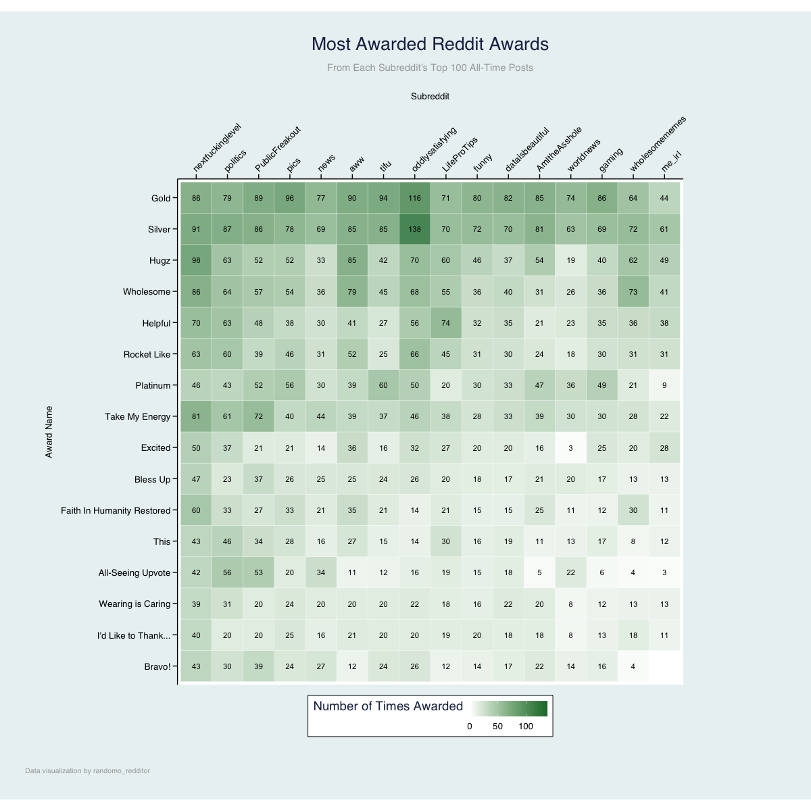

# Reddit Awards Data

## How to get data
A Python script, using the PRAW library to fetch 100 submissions of ~50 of the most popular subreddits. For each submission, each award was counted.

## Hot to plot data
THe data is plotted in R, using ggplot, showing how the top awards are distributed across the most popular and most awarded subreddits.

